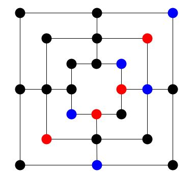

# [Nine Mens Morris (in German Mühle)](https://chrismotian.github.io/Nine_Mens_Morris/)

The common board game programmed and designed to sharp my skills in JavaScript, software design and composing game music

First approach was to create it object-oriented, but game logic finaly isn't because I decided that it's smarter to use an adjacent matrix to implement the connections.

I'm using the library [Fabric.js](http://fabricjs.com/)

# How to play

It's a local multiplayer game for 2 people

Because it's a classic board game please see the official rules in the [Wikipedia article](https://en.wikipedia.org/wiki/Nine_men%27s_morris). I will explain here just the details for my version and how to control.   

The first player is using the blue tokens.
The second the red ones.
Free fields are black

Click on a free field to place a token.

Click once on a blue token and then another time on a free field to move.
When you have 3 blue tokens in a row you can dismiss one of the other player's token by clicking on a red token.

Reload the website to play a second game.